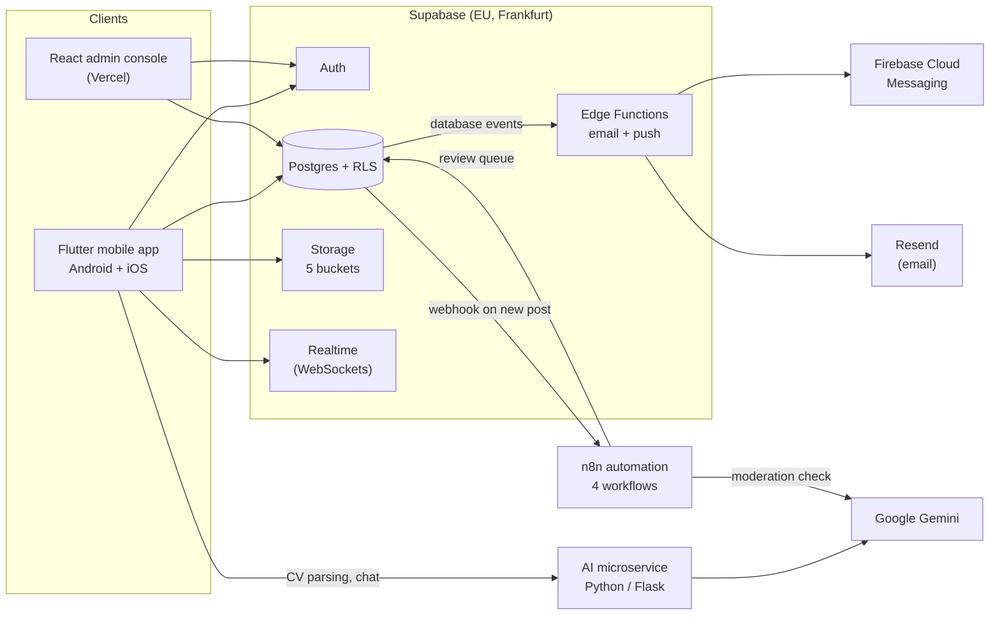

# Richfield Connect

> 🏆 **Winner — Richfield National Hackathon 2026**

A secure, four-role professional networking platform built for the **Richfield / AAA Hackathon 2026**, connecting **students**, **alumni**, **businesses** and **institutional administrators** in one trusted ecosystem, from a student's first enrolment through to career growth as an alumnus.

The **mobile app (Flutter, Android and iOS)** is the primary product surface, as the hackathon brief requires. The **React web app** is an administrator-only back office, not a parallel consumer experience.

> **Live project:** Supabase (`eu-central-1`, Frankfurt) · **Repo:** [`github.com/reilisticdev/richfield-connect`](https://github.com/reilisticdev/richfield-connect)

---

## Table of Contents

- [The Team](#the-team)
- [By the Numbers](#by-the-numbers)
- [The Problem](#the-problem)
- [What We Built](#what-we-built)
- [Feature Tour by Role](#feature-tour-by-role)
- [System Architecture](#system-architecture)
- [Tech Stack](#tech-stack)
- [How We Met the Brief](#how-we-met-the-brief)
- [Repository Structure](#repository-structure)
- [Getting Started](#getting-started)
- [Security Model](#security-model)
- [AI Microservice](#ai-microservice)
- [Automation Layer (n8n)](#automation-layer-n8n)
- [Testing & Quality](#testing--quality)
- [Build Timeline](#build-timeline)
- [Lessons from the Build](#lessons-from-the-build)
- [Roadmap](#roadmap)
- [Acknowledgements](#acknowledgements)

---

## The Team

Richfield Connect won the **Richfield National Hackathon 2026** (national round, 17 September 2026). It was built and presented by a team of five.

| Member | Role | What they built |
|---|---|---|
| **Reilyn Naidoo** | Tech Lead | Database and security architecture (50 migrations, Row-Level Security), Supabase Edge Functions, the Python/Flask AI microservice, push-notification delivery, secure admin provisioning, and the backend integration of the automation layer |
| **Keshav Ramphal** | Mobile & automation | The Flutter app's interface and features, the n8n automation workflows (content flagging, governance digests), and Android and UI/UX testing |
| **Saiyusha Tulsiram** | Web admin & documentation | The React admin console (users, moderation, opportunities, events, announcements, analytics), Vercel deployment, and technical documentation |
| **Sashen Naicker** | iOS | The iOS build of the Flutter app (Xcode project, CocoaPods and Flutter configuration) and device testing |
| **Diya Singh** | Presentation | The hackathon presentation and demo script |

### Folder ownership

Each area has a single owner during development, so concurrent work stays conflict-free. Cross-folder changes happen only as explicit, reviewed, one-time exceptions.

| Folder | Owner | Focus |
|---|---|---|
| `/supabase/migrations/`, `/supabase/functions/` | Reilyn | Schema, Row-Level Security, Edge Functions, push delivery |
| `/ai/` | Reilyn | AI microservice |
| `/mobile/` | Keshav | Flutter app, realtime and push notifications |
| `/mobile/ios/` | Sashen | iOS project and device testing |
| `/n8n/` | Keshav | Automation workflows |
| `/web/` | Saiyusha | React admin console, Vercel deployment, documentation |
| `/docs/` (deck and demo script) | Diya | Presentation deck and demo script |

All work happens on a branch and lands in `main` through a pull request. Nobody pushes to `main` directly.

## By the Numbers

Counts taken from the live project and the repository at the time of the hackathon.

| | |
|---|---|
| **Build window** | 28 Aug 2026 (first commit) to 17 Sep 2026 (national round) |
| **Pull requests merged** | 87 |
| **Commits on `main`** | 221 |
| **Database migrations** | 50, applied in order |
| **Tables** | 33 |
| **Row-Level Security policies** | 74 on application tables, plus 20 on storage |
| **Database functions** | 48 |
| **Storage buckets** | 5 (`avatars`, `post-media`, `cvs`, `alumni-verification-docs`, `business-verification-docs`) |
| **Edge Functions** | 3 (email confirmation redirect, transactional email, push notifications) |
| **n8n workflows** | 4 |
| **Admin console pages** | 9 |

## The Problem

Employability now depends on a digital portfolio and a professional network established well before graduation day, not after. Three gaps show up at most institutions, including Richfield:

- **Graduates need visible careers before they graduate.** Skills, projects and work experience live scattered across CVs, chat threads and memory, not in one verifiable place.
- **Institutions need a bridge to industry.** There is no trusted channel connecting current students, alumni, recruiters and industry partners in one ecosystem.
- **Existing tools are generic.** LinkedIn is not built for one institution, and a campus portal is not built for careers. Nothing verifies a Richfield identity, guides a student's profile, or matches talent to opportunity.

**Our response:** Richfield Connect is a mobile-first platform where students build a portfolio from day one, alumni stay engaged for life, businesses discover verified Richfield talent, and administrators govern the whole ecosystem with real backend security.

## What We Built

Richfield Connect is **one ecosystem, five working parts**, sharing a single Postgres database and a single set of authorization rules:

1. **Flutter mobile app (Android and iOS)**: the primary demo surface, for students, alumni and businesses.
2. **React web admin console**: administrator-only governance, deployed on Vercel.
3. **Supabase backend**: Postgres, Auth, Storage, Edge Functions and Realtime, all gated by Row-Level Security.
4. **Python/Flask AI microservice**: CV parsing, an onboarding and career assistant, and skill suggestions, powered by Google Gemini.
5. **n8n automation layer**: content flagging and scheduled governance workflows.

Every authorization rule that matters (who can read a profile, who can post an opportunity, who can suspend a member, who can approve anything) is enforced **in the database**, not just hidden behind a disabled button. A raw API call from a suspended account, an unauthenticated client, or a member outside their role is rejected by Postgres itself.

## Feature Tour by Role

### Student & Alumni

- **Trusted sign-up.** Students register only with a Richfield or AAA institutional email (`@my.richfield.ac.za`, `@richfield.ac.za`, `@my.aaa.ac.za`, `@aaa.ac.za`), enforced by a database trigger with a case-insensitive pattern that requires a real local part. Email is confirmed with a one-time code, and password reset works in-app.
- **Alumni verification.** The brief leaves alumni identity as a deliberate design challenge. Alumni register with their student number, programme, campus, graduation year and the **track ID printed on their degree or certificate**, then wait in an administrator review queue. A student number can go stale in institutional records over time, but a certificate's track ID does not. Every decision is audit-logged and triggers an email.
- **Digital portfolio, not a bio.** Skills, education, work experience, projects, certifications, badges, achievements, leadership roles, endorsements and recommendations, each with independent per-section visibility (Students, Alumni, Employers).
- **CV import.** Upload a PDF and Gemini reads it directly (no local text extraction, so scanned CVs still work) into strict, schema-validated JSON that pre-fills the portfolio. The original PDF stays on the profile as evidence, and a copy is snapshotted onto every job application at the moment of applying.
- **Career AI assistant.** A context-aware, consent-gated assistant that walks a new member through their profile one missing section at a time, gives advice based on their real profile, suggests skills to add, and drafts an opening message to a new connection. It stays available after onboarding.
- **First-run tutorial.** An interactive walkthrough fires automatically the first time each member signs in, followed by an offer of guided AI setup.
- **Employability score and analytics.** A nine-signal score computed on the device (so it is meaningful even for a brand-new profile), profile views, connection growth, engagement, the skills businesses search for, and a comparison with peers in the same programme. Students and alumni each see a dashboard titled for their role.
- **Career Pathways.** See where verified Richfield graduates go: the roles, employers and skills of alumni, grouped by the programme they studied (respecting each alumnus's privacy settings).
- **Social feed.** Text and short-form video posts (compressed to 720p and thumbnailed on the device before upload), reactions, comments and reposts. The feed is ranked by role affinity, connections, engagement, history and recency, with a "Newest first" option.
- **Networking.** Connection requests, member search, "people you may know" from shared skills and programme, **QR Connect** (a QR code that opens a member's profile through a deep link), and the ability to block a member.
- **Direct messaging.** Realtime one-to-one chat with read receipts. Sharing a post to a connection sends a card that opens the post; any message can be reported to moderators.
- **Opportunities and events.** Browse, filter and apply to admin-approved listings, ranked by an explainable skills-and-programme match. Institutional events appear in the feed and the events list.
- **Notifications.** Realtime in-app notifications over WebSockets, plus push through Firebase Cloud Messaging.
- **POPIA privacy controls.** Recorded consent, per-section visibility, and self-service **export of your data** and **deletion of your account**, both backed by real database functions rather than a support ticket.

### Business

- **Verified before trusted.** A business registers with its company details and registration number, uploads a supporting document from the pending-approval screen, and cannot post anything until an administrator approves it. The document reference is cleared once a decision is made.
- **Opportunity management.** Post, edit, withdraw and delete listings. Listings become visible to students only after administrator approval, and the database itself prevents a business from setting its own listing to "approved".
- **Applicants and analytics.** Review applicants with the CV they attached, and see an applicant pipeline, candidate skill distribution, listing engagement and profile reach, all computed by Postgres aggregate functions.

### Administrator

- **No self-registration, ever.** Administrator accounts exist only through an out-of-band, service-role provisioning script.
- **Web admin console** (React), with pages for:
  - **Dashboard**: pending approvals, flagged content, opportunities and events at a glance.
  - **Users**: view, suspend, reactivate and remove any member.
  - **Moderation**: approve or reject alumni claims (with track ID) and business applications (with registration number and a signed-link view of the supporting document), and review flagged content, including posts flagged automatically by the automation layer.
  - **Opportunities**: approve, reject or remove listings before students see them.
  - **Events**: create, edit, publish, archive and restore institutional events.
  - **Announcements**: broadcast to every member or to a single role.
  - **Analytics**: total accounts, monthly active users, registration trend, content volume, engagement and business pipeline.
  - **Audit Log**: an append-only record of every administrator action, with the option to reverse a suspension directly from the entry.
- Administrators who sign in on the phone are directed to the web console.

### Cross-cutting

- **Realtime where it matters.** Messages, notifications and live dashboard figures update without a manual refresh.
- **Video pipeline.** On-device 720p compression, thumbnail generation and in-feed playback, so no raw video reaches storage.
- **Transactional email.** Welcome, confirmation, password-reset and verification-decision emails through Resend, sent by an Edge Function.
- **Light and dark themes** across the mobile app.

## System Architecture



- **Clients** talk to Supabase over HTTPS (PostgREST) and a Realtime WebSocket. Every request runs under the signed-in user's identity, so Row-Level Security applies to it.
- **The AI microservice** receives a profile summary from the client with each request and does not query or write the database. Anything the AI produces is saved by the client through the normal, RLS-protected path.
- **Database events** (a new post, a verification decision, a new notification) trigger Edge Functions and the n8n webhook, which keeps the client thin.
- **Secrets** used by database webhooks live in Supabase Vault, not in trigger definitions.

## Tech Stack

| Layer | Technology | Why |
|---|---|---|
| **Mobile app** | [Flutter](https://flutter.dev) (Dart 3), [go_router](https://pub.dev/packages/go_router), `supabase_flutter`, `firebase_messaging` | One codebase for Android and iOS, with a router that reacts to live Supabase auth state (role- and account-status-aware redirects) instead of a static route table. |
| **Web admin** | [React](https://react.dev) 19, [Vite](https://vitejs.dev), [react-router](https://reactrouter.com) 7, [Recharts](https://recharts.org), deployed on [Vercel](https://vercel.com) | A fast dev loop for an internal-only surface with no SEO or server-rendering requirement. |
| **Backend** | [Supabase](https://supabase.com): Postgres, Auth, Storage, Edge Functions (Deno), Realtime, Vault | One managed platform for a relational database, authentication, row-level authorization, file storage, serverless functions and realtime, with no hand-rolled auth or separate pub/sub service. |
| **Database** | Postgres | The data is relational by nature. Profiles, skills, endorsements, connections, messages, opportunities and applications are many-to-many with real referential-integrity requirements, so we chose SQL over NoSQL deliberately. |
| **AI microservice** | Python, [Flask](https://flask.palletsprojects.com), [Google Gemini](https://ai.google.dev) via `google-genai` | CV parsing, an onboarding assistant and skill suggestions, kept as a separate service so it can deploy and iterate independently. |
| **Automation** | [n8n](https://n8n.io) | Visual, auditable workflows for content flagging and scheduled governance tasks. |
| **Notifications** | Supabase Realtime, Firebase Cloud Messaging | WebSockets for in-app updates, FCM for push. |
| **Email** | [Resend](https://resend.com) | Transactional email from an Edge Function. |

## How We Met the Brief

The hackathon checklist has 13 sections. This is where each one lives in the codebase.

| Section | Where to look |
|---|---|
| **1. User types & authentication** | Four roles with backend-enforced RBAC (`supabase/migrations/001`–`009`, `043`); institutional-domain trigger; alumni claim-and-review flow (`007`, `048`); business approval (`021`, `022`, `045`); admin provisioning script (`supabase/scripts/provision-admin.ts`) |
| **2. Administrator panel** | `web/src/pages/`: Users, Moderation, Opportunities, Events, Announcements, Analytics, Audit Log |
| **3. User profiles** | Portfolio sections, badges, CV evidence, visibility controls, company profiles (`010`, `015`, `016`, `030`, `038`) |
| **4. Connections & social** | Connections, feed with role-aware ranking, short video, messaging, comments, reactions, blocking (`012`, `026`, `032`, `042`) |
| **5. Opportunities & career** | Listings with admin approval, applications with CV snapshot, skills/programme matching, Career Pathways, events (`011`, `026`, `031`, `039`, `047`) |
| **6. Onboarding & chatbot** | `ai/app.py`, `mobile/lib/screens/ai_assistant_screen.dart`, first-run tutorial |
| **7. Analytics dashboards** | Distinct student/alumni, business and administrator dashboards on database RPCs (`017`, `018`) |
| **8. Additional technical features** | Realtime notifications, skills/programme matching, Gemini CV parsing, on-device video compression and thumbnails |
| **9. Stack & architecture** | [System Architecture](#system-architecture) and [Tech Stack](#tech-stack) above |
| **10. Source repository** | This README, `docs/README.md`, per-folder READMEs, and a pull-request-based history |
| **11. Working prototype** | Android and iOS builds, plus the web admin console |
| **12. Presentation** | `docs/Richfield_Connect_Rework_Final.pptx` |
| **13. Live demo** | `docs/Richfield_Connect_Demo_Script_Final.docx` |

## Repository Structure

```
richfield-connect/
├── mobile/                 Flutter app: Android + iOS, the primary product surface
│   ├── lib/
│   │   ├── screens/        Feature screens (AI assistant, messaging, network, portfolio, ...)
│   │   ├── services/       Supabase, AI, realtime and notification service wrappers
│   │   ├── router/         go_router config with auth-aware redirects
│   │   ├── widgets/        Shared UI components
│   │   └── config/         Supabase and AI server-address resolution
│   ├── ios/                iOS project (Xcode, CocoaPods)
│   ├── android/            Android project
│   └── test/               Unit and widget tests
├── web/                    React admin console (Vite), administrators only
│   └── src/pages/          Dashboard, Analytics, Users, Moderation, Opportunities,
│                           Events, Announcements, AuditLog, Login
├── ai/                     Python/Flask AI microservice (app.py)
├── n8n/                    Automation workflows (JSON) with a README per workflow
├── supabase/
│   ├── migrations/         50 numbered, sequential SQL migrations: the schema's source of truth
│   ├── functions/          Edge Functions: email-confirmed, send-notification-email,
│   │                       send-push-notification
│   └── scripts/            Operational scripts (admin provisioning)
├── scripts/                Deployment helpers
├── docs/                   Documentation index, presentation deck and demo script
└── README.md
```

## Getting Started

### Prerequisites

- A Supabase project (Postgres, Auth, Storage, Edge Functions, Realtime)
- [Node.js](https://nodejs.org) 18+ (web console, Supabase scripts, n8n)
- [Flutter SDK](https://docs.flutter.dev/get-started/install) (stable channel); macOS with Xcode for iOS builds
- Python 3.11+ for the AI microservice

### 1. Database

Apply the migrations in `supabase/migrations/` **in numeric order**. They are additive and sequential, so never skip or reorder them:

```bash
supabase db push
```

or run them one file at a time in the Supabase SQL editor.

### 2. Web admin console

```bash
cd web
npm install
```

Create `web/.env.local`:

```
VITE_SUPABASE_URL=https://<your-project-ref>.supabase.co
VITE_SUPABASE_ANON_KEY=<your-anon-key>
```

```bash
npm run dev
```

### 3. Mobile app

```bash
cd mobile
flutter pub get
```

Set your Supabase project URL and anon key in `mobile/lib/config/supabase_config.dart` (the anon key is safe to commit: it is public and gated by RLS). Add your own Firebase configuration files, which are deliberately kept out of git: `android/app/google-services.json` and `ios/Runner/GoogleService-Info.plist`.

Point the app at the AI microservice by setting `app_config.ai_base_url` in Supabase. Every signed-in client picks it up within a minute, with no rebuild. It can also be overridden per device from the in-app "AI server address" dialog.

```bash
flutter analyze          # run before flutter run
flutter run              # Android device or emulator
```

For iOS (on macOS):

```bash
cd mobile/ios && pod install && cd ..
flutter run -d <ios-device-id>
```

### 4. Admin provisioning

There is no self-registration path for administrators, by design. To create the first admin account:

```bash
cd supabase/scripts
npm install
cp .env.example .env    # fill in SUPABASE_URL, SUPABASE_SERVICE_ROLE_KEY, ADMIN_EMAIL, ADMIN_PASSWORD, ...
npx tsx provision-admin.ts
```

This uses the **service role key**. Never commit `.env` or expose that key to a client. The script refuses to run a second time unless `--force` is passed.

### 5. AI microservice

```bash
cd ai
python -m venv venv
source venv/bin/activate     # Windows: venv\Scripts\activate
pip install -r requirements.txt
cp .env.example .env         # see the file for the variables to fill in
flask run
```

During development the service is usually exposed through an HTTPS tunnel. `curl <url>/health` confirms it is alive before you publish the URL to `app_config.ai_base_url`.

### 6. Automation (n8n)

```bash
npx n8n start
```

Import the workflow JSON files from `n8n/`, then provide the environment variables the workflows read: `SUPABASE_URL`, `SUPABASE_SERVICE_ROLE_KEY`, `GEMINI_API_KEY`, `N8N_WEBHOOK_SECRET`, and `N8N_BLOCK_ENV_ACCESS_IN_NODE=false`. The digest workflows also need `RESEND_API_KEY`, `ADMIN_DIGEST_EMAILS` and `DIGEST_FROM_EMAIL`. Each workflow has its own README in [`n8n/`](n8n/), and [`n8n/SECURITY-AND-HOSTING.md`](n8n/SECURITY-AND-HOSTING.md) covers hosting.

The content-flagging workflow is triggered by a database trigger. Set the webhook secret in Supabase Vault (`n8n_webhook_secret`, via `admin_upsert_vault_secret`) and the webhook address in `app_config.n8n_webhook_base_url`.

### 7. Edge Functions

`scripts/windows/deploy-functions.ps1` deploys the Edge Functions. See [`supabase/functions/README.md`](supabase/functions/README.md) for the secrets they need.

## Security Model

- **Row-Level Security is the real authorization boundary.** 74 policies on application tables and 20 on storage are enforced by the database. A raw API call from a suspended, unauthenticated or wrong-role client is rejected by Postgres itself.
- **Privileged fields are locked at the privilege level, not just by policy.** Clients have no `UPDATE` grant on `profiles.account_status`, and may update only a short list of profile fields. Approval and rejection happen only through `SECURITY DEFINER` functions that check the caller is an administrator, act only on rows still pending, and write an audit record.
- **Self-approval is closed off.** A trigger pins an opportunity's status so only an administrator can approve it, and the alumni claim policy accepts only new claims in the `pending` state. Both gaps were found by probing the live database as an ordinary user, then fixed and re-verified.
- **Column-level privacy.** `profiles.email` and `profiles.fcm_token` are not readable by members, and `select *` on `profiles` is refused. An administrator-only view is the single read path that includes email.
- **Secrets stay out of the database.** Webhook secrets and gateway keys are read from Supabase Vault at run time. The service-role key is not stored in the database.
- **Suspended accounts** can read and delete their own content but cannot create or edit anything, enforced by `WITH CHECK` clauses on every relevant policy.
- **Private files stay private.** CVs and verification documents live in private buckets and open only through short-lived signed links, visible to the owner and administrators. The supporting-document reference is cleared once a verification decision is made.
- **No self-registering administrators**, and no role can be chosen at sign-up. See [Admin provisioning](#4-admin-provisioning).
- **Domain-restricted student sign-up**, enforced by a database trigger rather than client-side validation.
- **Blocking and reporting.** Blocks are one-way and invisible to the blocked member; messages and connection requests are refused in both directions. Members can report posts, comments and messages, which land in the moderation queue.
- **POPIA.** Recorded consent for the AI assistant, per-section visibility, `export_my_data()` and `delete_my_account()`.
- **Every administrator decision is audit-logged**, including who acted, on whom, and when.

## AI Microservice

The Flask service (`ai/app.py`) uses Google's `google-genai` SDK. The model is set by a single constant near the top of the file.

| Endpoint | Method | Purpose |
|---|---|---|
| `/health` | GET | Liveness check |
| `/api/parse-cv` | POST | Accepts a PDF upload or raw text. Gemini reads the PDF directly, so scanned CVs work, and returns strict, schema-validated JSON. 5 MB cap and magic-byte validation. |
| `/api/chat` | POST | Context-aware onboarding and career assistant. Receives the caller's profile summary and recent conversation turns (capped in length) with each request. |
| `/api/suggest-skills` | POST | Suggests skills to add, based on the caller's profile. |

**Privacy by design.** The client asks for consent before anything is sent to the service. The service sees a profile summary and whatever the member types or pastes, never the database, and holds no conversation history of its own.

**Operating note.** Gemini's free tier applies daily request limits per model. If the service starts returning errors after heavy use, check the logs for a quota error and switch the model constant to one with headroom. `app_config.ai_base_url` lets you move the service to a new address without rebuilding the app.

## Automation Layer (n8n)

Four workflows keep the platform governed without manual effort. The JSON files and a README for each are in [`n8n/`](n8n/).

| Workflow | Trigger | What it does |
|---|---|---|
| **Auto-Flag Inappropriate Content** | A database trigger fires a webhook on every new post | Scores the post with a keyword pass, optionally escalates to Gemini for a moderation check, and files a report in the same moderation queue administrators already use. It fails open: if the AI check errors, the post is never blocked. |
| **Pending Verification Chaser** | Every 6 hours | Emails administrators a digest of alumni claims that have been pending for more than 24 hours. |
| **Daily Governance Digest** | Daily at 07:00 | Emails administrators a summary of the previous 24 hours of account actions and verification decisions. |
| **Stale Event Cleanup** | Daily at 00:15 | Archives past-dated events so they leave the listings (recoverable from the admin console) and emails a summary. |

The webhook rejects any request without the correct secret header before it parses anything.

## Testing & Quality

- **Mobile:** `flutter analyze` with no errors or warnings, and unit and widget tests across seven suites (auth error mapping, feed ranking, employability score, deep-link parsing, portfolio entry, registration validation). Some tests drive the real UI rather than mocking it away.
- **Database:** every non-trivial RLS policy and RPC is verified with a rolled-back SQL transaction against the live schema, acting as the relevant role, before it is trusted. Reading a migration file is not treated as proof.
- **Web:** `npm run lint` and `npm run build` as a baseline gate before merge.
- **Devices:** signed-in flows were tested on physical Android devices and on a physical iPhone 15 Plus.

## Build Timeline

- **26 Aug** — Hackathon brief received; architecture and stack decisions documented.
- **28 Aug** — Repository created. Migrations 001–009: schema, profile trigger, institutional-domain restriction, role lockdown, admin policies, alumni verification, function-execute lockdown.
- **6–9 Sep** — Mobile and web foundations. Portfolios, opportunities, social schema, events and notifications, pgvector groundwork, POPIA foundations, business profiles, analytics, business approval, announcements (010–023). First administrator provisioned.
- **10–11 Sep** — Media links and reposts, push tokens, realtime messaging and notifications, sign-up details, POPIA export and delete, Career Pathways, feed reactions, comments and moderation, admin account management, runtime AI server configuration (024–035). The AI microservice is wired into the app.
- **12–13 Sep** — Security hardening: webhook secrets moved to Vault, column-level profile privacy, CV kept as evidence and snapshotted on applications, suspended-account write hardening (036–040). Short-form video pipeline, in-app email confirmation and password reset, Audit Log, Employability Score, QR Connect.
- **13–14 Sep** — Email delivery stabilised, admin analytics expanded, moderation and listing management, share sheet, profile photos, notification management, Vercel routing fix.
- **15–16 Sep** — Campus round won. Two teams merged into the team of five.
- **16 Sep** — User blocking, stricter student-email validation, n8n automation integrated, business verification documents, alumni certificate track ID, and two self-approval gaps closed after live-database probing (042–049).
- **17 Sep** — National round. iOS build completed, message reporting (050), tappable shared posts, a per-user onboarding fix, and final QA. **We won.**

## Lessons from the Build

- **Authorization belongs in the database.** Two real gaps (a business self-approving a listing, an alumnus inserting a pre-approved claim) were invisible from the UI and found only by probing the live database as an ordinary user.
- **A green tick isn't proof.** One scheduled workflow reported success on every run while never sending a single email, because a step that returned zero rows silently ended the run. We now verify outcomes, not statuses.
- **Silent failures hide in write paths.** A write that Row-Level Security filters to zero rows raises no error. Every write whose result matters selects the row back and treats an empty result as a failure.
- **Test as the newest user.** The first-run tutorial was tracked per device, not per person, so a new sign-up on a shared test phone never saw it.
- **Read the library's defaults.** `postgrest-dart` orders descending by default, which put the furthest event, not the next one, on the feed.
- **Keep external limits configurable.** Free-tier AI quotas are real. The model is one constant and the service address lives in a database row, so recovery takes minutes, not a rebuild.

## Roadmap

- Image moderation for uploaded media.
- Connectivity indicators and graceful offline behaviour, including a CV-upload fallback when the AI service is unreachable.
- In-app alerts when a business removes a listing a member applied to.
- Editable draft listings for businesses before approval.
- Alumni certificate upload from the mobile app (the storage bucket, policies and admin viewer already exist).
- Administrator multi-factor authentication and leaked-password protection at the auth layer.
- Permanent hosting for the AI microservice and n8n.
- Semantic opportunity matching using the pgvector columns already in the schema.

## Acknowledgements

Thank you to **Richfield** for the opportunity and the platform, and to our lecturers and campus manager for honest, sometimes tough feedback that shaped what we built, including how alumni are verified.

---

*Built for the Richfield / AAA Hackathon 2026.*
